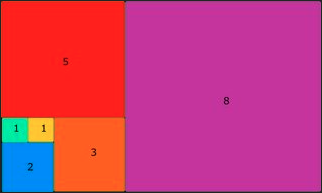

# Alpha TDD Process Excercises

Some easy excercises to practise TDD on or to help with learning a new language. Pairing is strongly recomended set a timer for 20-30mins after the timer is up give feedback to the person who was coding. 

TDD cycle defines (Red, Green, Refactor)

1. Write a test
2. Make it run and watch it fail.
3. Get the test to pass
4. Refactor
5. Commit
6. Repeat process.


Tip: Open Quick time and record your screen as you code then watch it back in x2 and see if you can find any imporvements in your process. Other good practise is to review others videos in exchange for having yours reviewed.

---

## Test coverage:

coverage < 95% : Bad

coverage > 95% : Good 

coverage == 100% : Perfect

All of these problems can (and should) be done to have 100% test coverage. 

## Middle Letter - Easy 

 - Program runs on the command line 
 - Use any language 
 - Return the middle letter of  a word. If the word's length is odd, return the middle letter. If the word's length is even return the middle two letters.

```python
get_middle('test') # => es
get_middle('testing') # => t
get_middle('middle') # => dd
get_middle('A') # => A
```

# Problems

### If you have any good ones please add them!
<br>

## 10 Minute Walk - Easy

Create a function that will return true if the walk will take you exactly ten minutes and will return you to your starting point.

### Requirements

You are meeting a friend in New York City, where all roads are laid out in a perfect grid. You arrived ten minutes too early to the appointment, so you decided to take the opportunity to go for a short walk.
The city provides its tourists with a Walk Generating App on their phones -- everytime you press the button it sends you an array of one-letter strings representing directions to walk. eg. ['n', 's', 'w', 'e']

You always walk only a single block in a direction and you know it takes you one minute to traverse one city block, so create a function that will return true if the walk the app gives you will take you exactly ten minutes (you don't want to be early or late!) and will, of course, return you to your starting point. Return false otherwise.

Note: you will always receive a valid array containing a random assortment of direction letters ('n', 's', 'e', or 'w' only). It will never give you an empty array (that's not a walk, that's standing still!).

```python
ten_minute_walk(['w', 's', 'e', 'e', 'n', 'n', 'e', 's', 'w', 'w']) # => true
ten_nimute_walk(['w', 's', 'e', 'n', 'n', 'e', 's', 'w', 'w', 'w']) # => false
ten_minute_walk(['w','s']) # => false
```

## Scrabble Solver - Medium

Given a word, compute the scrabble score for that word.

### Letter values 

| Letter | Value |
| :---: | :--: |
A, E, I, O, U, L, N, R, S, T | 1 |
D, G |	2 |
B, C, M, P | 3 |
F, H, V, W, Y | 4 |
K | 5 |
J, X | 8 |
Q, Z | 10 |

Examples 'cabbage' should be scored as worth 14 points: 

- 3 points for C
- 1 point for A, twice 
- 3 points for B, twice 
- 2 points for G
- 1 point for E 

And to total

3 + 2x1 + 2x3 + 2 + 1 = 14

Acceptance Criteria

- Word agnostic, just counting letters. 

```python 
scrabble = Scrabble('')
scrabble.score() # => 0 

scrabble = Scrabble('\t\n')
scrabble.score() # => 0

scrabble = Scrabble(None)
scrabble.score() # => 0

scrabble = Scrabble('f')
scrabble.score() # => 4

scrabble = Scrabble('street')
scrabble.score() # => 6

scrabble = Scrabble('OXYPHENBUTAZONE')
scrabble.score() # => 41
```

## Perimeter of squares in a rectangle - Medium

The drawing shows 6 squares of which have a length of 1,1,2,3,5,8. The total of all of the perimeters of the squares sums to 80. 

 

Could you give the sum of the perimeters of all the squares in a rectangle when there are n + 1 squares disposed in the same manner as in the drawing. 

```python
perimeter(5) # => 80 as seen above
perimeter(7) # => 216
perimeter(20) # => 114624
perimeter(100) # => 6002082144827584333104
```
Hint: See the fibonnaci sequence.

## Sums of Perfect Squares - Hard 

Given an integer n(3 < n < 10^9), find the length of the smallest list of perfect squares (an integer that is the square of an integer) which add up to n.

Example: 

```python
sum_of_squares(17) # => 2
# 17 = 16 + 1 ( 4 and 1 are perfect squares ).

sum_of_squares(15) # => 4
# 15 = 9 + 4 + 1 + 1.

sum_of_squares(16) # => 1
# 16 itself is a perfect square. 
```

Your the function shouldn't take long to run, be sure to pay attension to time complexity here. Try and reflect this constraint in your tests if you can. 

## Random Pi - Harder

Hint at bottom of exercise. 

Using a random function, i.e for python:

```python 
import numpy as np

np.random.uniform(0,1)
```

Create a function that takes an arguement that is the number of calls made to the random function. As the number of calls increases the output should approach pi. It will look something like:

```python
approximate_pi(100) # => 4.2232...
approximate_pi(1000) # => 3.214...
approximate_pi(10000) # => 3.141...
```

Answers should be returned to at least 2 decimal places. 


### Hint: 
Think about distance from a point and calling the random function twice seperately. Start plotting these points on a piece of paper. It is also worth rembering whenever you see Pi think Circles. You will also have to think about ratios.